To insert a plot. First use matplotlib (or another tool) to create your plot and create a png from it. You can insert in markdown file as 

| 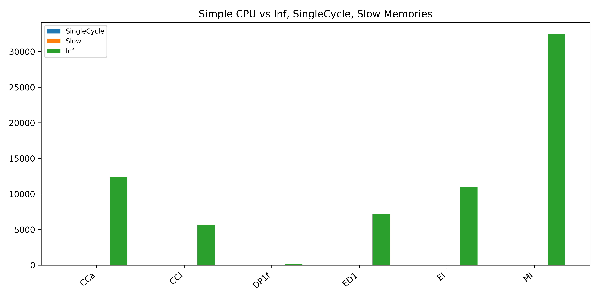 | 
| 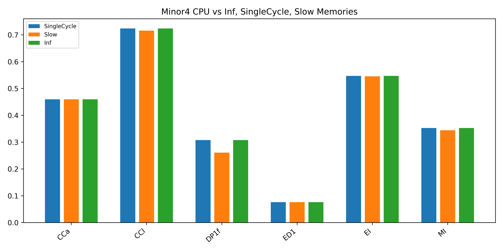 | 
| 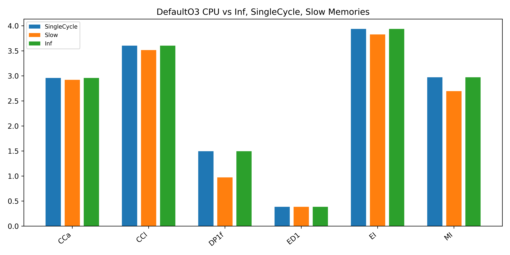 | 
| 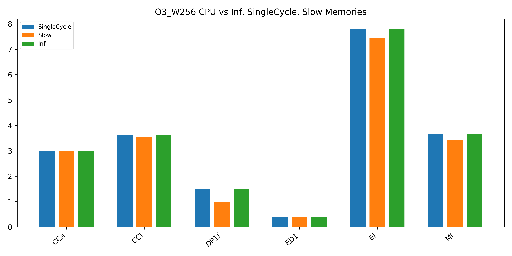 | 
|  | 
|:--:| 
| **Figure 1: Comparison between CPUs** |

## 1. What metric should you use to compare the performance between different system configurations? Why?
IPC (Instructions Per Cycle) should be used to compare the performance between different system configurations because it measures how many instructions a CPU can execute on average in a single clock cycle for differenet memory models. It allows to assess how well each CPU performs when paired with different memory models and also shows the impact of memory models on CPU performance. For example, some memory models may have lower access latencies and higher bandwidth, allowing the CPU to fetch data more quickly and execute instructions faster.
## 2. Which benchmark was sensitive to CPU choice? Which benchmark was sensitive to memory model choice ? Why ? 
`Hint: Look at the code of these benchmarks`

CCa, CCI and EI are sensitive to CPU choice and DP1f, ED1, MI are sensitive to memory model choice. For CCa, CCI and EI, they all involve iterative computations within a loop. The loop has both conditional branches and arithmetic operations. The CPU choice can significantly impact the performance due to differences in branch prediction and execution efficiency. For DP1f, ED1, and MI, they all involve memory intensive operations where memory latency and bandwidth can have a impact on performance. For example, DP1F has the floating-point arithmetic operations in the loops and the performance of the floating-point computations can be affected by memory latency and bandwidth. ED1 has the loop iterations with integer operations and divisions which can be critical because memory access latency can affect the execution time of divisions and integer operations. MI is stands for Memory Intensive and it involves memory accesses in a loop, and the choice of memory model can impact memory access latency, bandwidth, and execution time.

## 3. Which CPU model is more sensitive to changes in cache size.

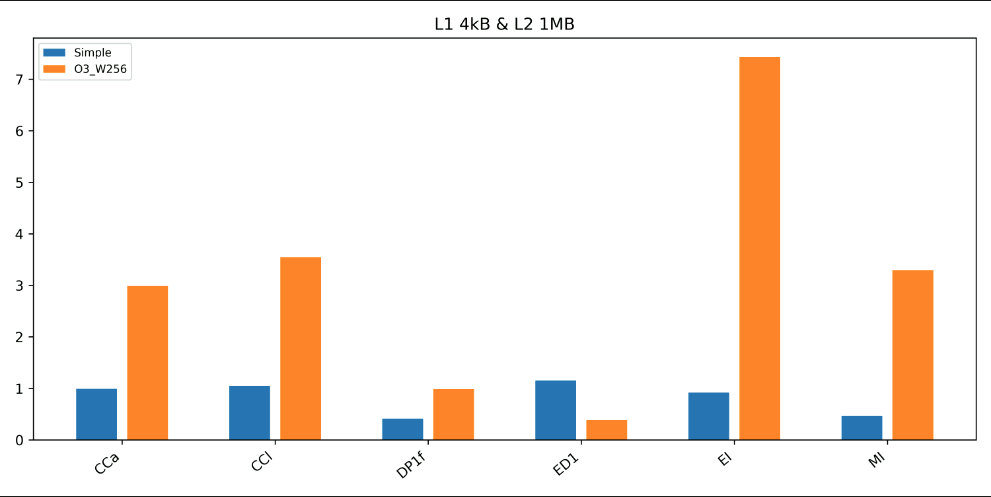

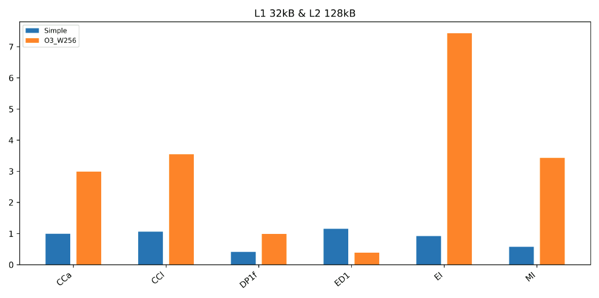
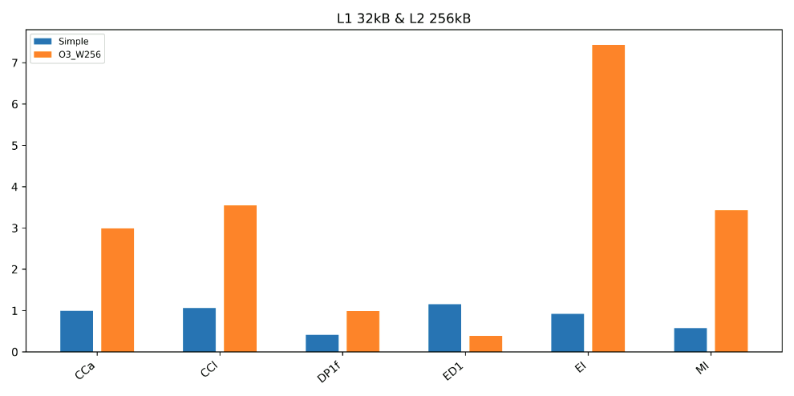

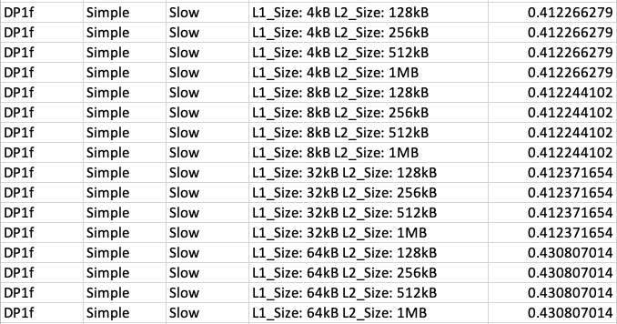
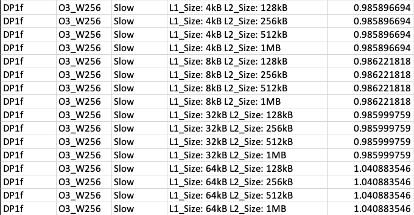

By comparing the IPC (Instructions Per Cycle) between the two CPU models for each cache configuration, I was able to observe that the Simple CPU showing the larger performance variation than the O3_W256 CPU. For both CPUs the variation of IPC are more noticiable from the DP1f and MI benchmarks and other benchmarks only shows little variations or even no changes. From above images, the ipc values are increased hugely when the L1 cache size is increased. From MI benchmark, we can see the huge change between the ipc of Simple CPU with L1_Size: 4kB L2_Size: 1MB and the ipc of Simple CPU with L1_Size: 8kB L2_Size: 128MB. The difference is 0.564937132 - 0.466026997 = 0.098 On the other hand, from DP1f benchmark, we can see the huge change between the ipc of O3_W256 CPU with L1_Size: 32kB L2_Size: 1MB and the ipc of O3_W256 CPU with L1_Size: 64kB L2_Size: 128MB. The difference is 1.040883546 - 0.985999759 = 0.0548 As such, we can see the Simple CPU is more sensetive to changes in cache size as it has bigger difference.

## 4. Which application more sensitive to the CPU model or cache size ?
If the performance of a benchmark application varies significantly when changing CPU models it means it is more sensitive to the CPU model. Conversely, if performance varies more with changes in cache size, it is more sensitive to cache configurations. By comparing the performance of the benchmark applications under different CPU models and cache sizes, I observered that the EI benchmark application is most sensitive to the CPU model. From the above image, we can see the IPC does not change much by increasing size of caches. However, for the O3_W256 CPU, the CPU runs about 7.4 instructions per cycle and for the Simple CPU it runs about 0.9 instructions per cycle even thought they have the same sizes of L1 and L2 caches. For the cache size, the DP1f benchmark application is the most sensetive to cahche size. Based on the data, we would say the EI benchmark is the most sensitive to the CPU model and the DP1f benchmark application is the most sensetive to cahche size.

## 5. What is the best performing configuration for each benchmark ? Why ?
For CCa benchmark, the best performing configuration is when the O3_W256 CPU with L1 size 4kB and L2 size 128kB, 256kB, 512kB or 1MB. For CCI benchmark it is when the O3_W256 CPU with all the different cache configurations. For DP1f benchmark it is when the O3_W256 CPU with L1 size 64kB and L2 size 128kB, 256kB, 512kB or 1MB. For the ED1 benchmark it is when the Simple CPU with all the different cache configurations. For EI benchmark it is when O3_W256 CPU with all the different cache configurations. For MI benchmark it is when O3_W256 CPU with L1 size 32kB or 64kB and L2 size 128kB, 256kB, 512kB or 1MB. For the most benchmarks, the CPU 03_W256 performs best because the O3_W256 CPU uses out-of-order execution, while the Simple CPU is typically in-order. OOO execution allows the CPU to execute instructions as soon as their operands are ready, rathen than strictly following the program order. Also, the O3_W256 CPU's OOO execution and wider issue width can better utilize larger caches and extract more performance benefits from them.
## 6. What is the pareto optimal L1+L2 cache configuration for each benchmark. Plot a 2-D scatter plot comparing total cache size against performance normalized to a 4KB-128KB cache configuration.

## 7. Which CPU model is more sensitive to changing the CPU frequency? Why?

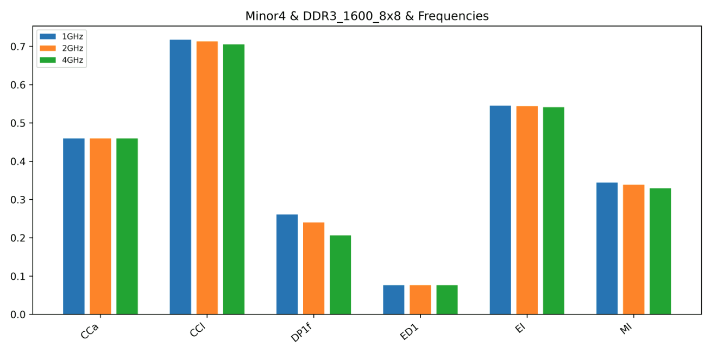
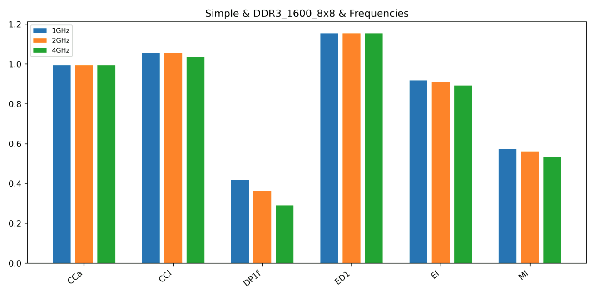
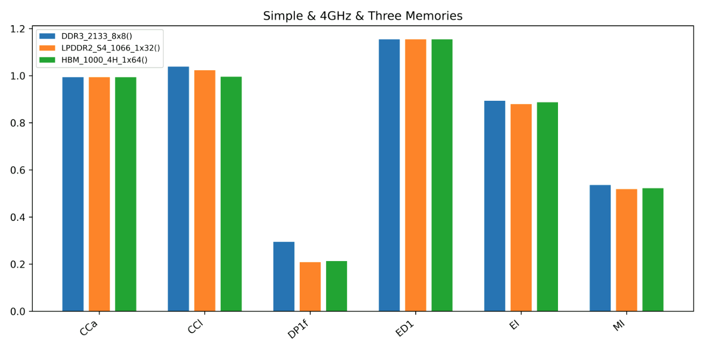
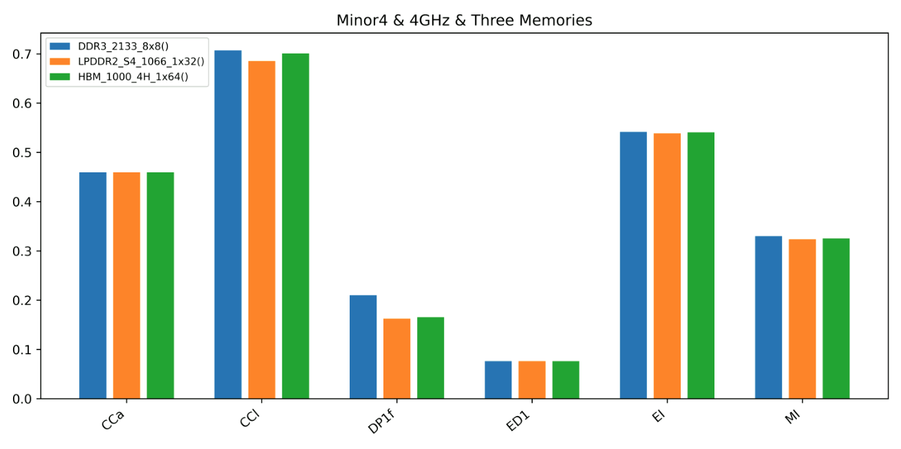
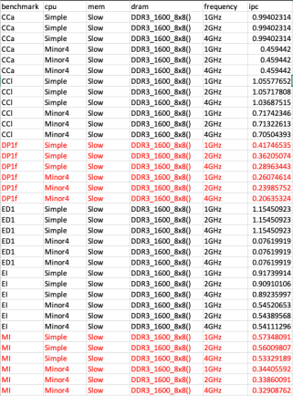

For the "Simple" CPU model:

At 1GHz: IPC = 0.41746535
At 2GHz: IPC = 0.36205074
At 4GHz: IPC = 0.28963443

For the "Minor4" CPU model:
At 1GHz: IPC = 0.26074614
At 2GHz: IPC = 0.23985752
At 4GHz: IPC = 0.20635324

The Simple CPU model generally shows the dramastic changes in IPC values compared to the Minor4 CPU model from DP1f benchermark. When the CPU frequency increases from 1GHz to 2GHz, both CPU models experience a decrease in IPC, but the "Simple" CPU model decreased more than Minor4 CPU. Also, when the CPU frequency increases from 2GHz to 4GHz, both CPU models again experience a decrease in IPC, the Simple CPU model decreased more than Minor4 CPU again. Based on the data provided, the Simple CPU model is more sensitive to changing the CPU frequency. It shows a bit more larger decrease in IPC as the frequency increases from 1GHz to 4GHz compared to the Minor4 CPU model. The Simple CPU is more sensitive to changing the CPU frequecny because the Simple CPU has a simpler microarchitecture with fewer features for handling dynamic frequency changes. In contrast, the Minor4 CPU has more sophisticated mechanisms to adapt to varying frequencies, leading to more stable IPC values.
## 8. Which CPU model is more sensitive to changing the memory technology? Why?
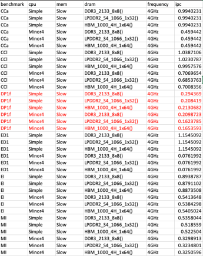

For the "Simple" CPU model:

DDR3_2133_8x8: IPC = 0.29436902
LPDDR2_S4_1066_1x32: IPC = 0.20841903
HBM_1000_4H_1x64: IPC = 0.21306821

For the "Minor4" CPU model:

DDR3_2133_8x8: IPC = 0.20987225
LPDDR2_S4_1066_1x32: IPC = 0.16237851
HBM_1000_4H_1x64: IPC = 0.1653593

From the data, we can observe that both CPU models show a decrease in IPC when transitioning from DDR3_2133_8x8 to LPDDR2_S4_1066_1x32 or HBM_1000_4H_1x64. However, the Simple CPU exhibits a larger decrease in IPC compared to the Minor4 CPU. The Simple CPU is more sensitive to changing the memory technology compared to the Minor4 CPU. This sensitivity is reflected in the larger drop in IPC values when transitioning to different memory technologies. The reasons behind this difference in sensitivity can be attributed to the microarchitectural design and memory subsystem optimizations of the two CPU models. The Minor4 CPU may have a memory subsystem that is better optimized to handle different memory technologies, allowing it to mitigate some of the performance impacts associated with the memory type change. The Simple CPU might have memory access patterns that are more affected by changes in memory technology, resulting in more frequent memory related stalls.
## 9. How does the benchmark influence your conclusion? Why?
Some benchmarks may be more sensitive to changes in CPU frequency, while others may rely more on memory bandwidth and latency. According to the data, the DP1f benchmark is strongly affected by changes in memory technology as well as influenced by CPU frequency changes. Compare to other benchmarks, DP1f showed dramatic changes in IPC for experiment 3.1 and experiment 3.2, which helped me to come to the above decision.
## 10. Compare each of the configurations in Experiment 3.2 with the one that matches the CPU type and frequency in Experiment 3.1 (i.e. the baselines in bold), do you see any difference in performance? If so, why?
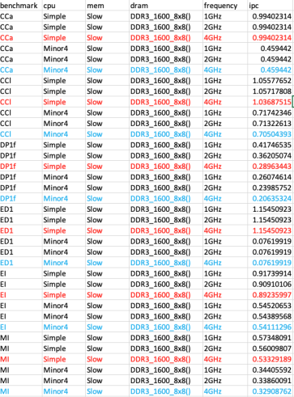
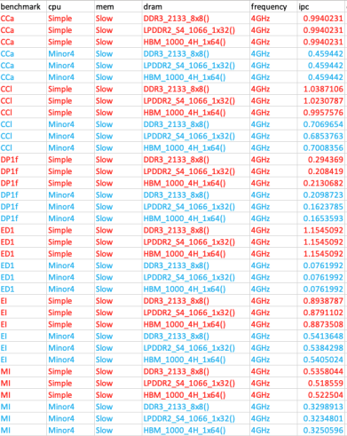

By comapring each of the configurations in Experiment 3.2 with the one that matches the CPU type and frequency in Expreiment 3.1, I observed that there is not much difference in performance in terms of IPC values. Some of them are pretty same and some of them are just very little difference. In the experiments, we kept the CPU frequency constant at 4GHz for all configurations in both Experiment 3.1 and Experiment 3.2. This means that the core operating frequency remained the same, which can limit the variation in IPC. IPC is often directly influenced by the clock speed, and when the clock speed is constant, it can minimize the impact of other factors.

## 11. Which result is more "correct"? If someone asked you which system you should use, which methodology gives you a more reliable answer?
Which result is more "correct" or which methodology is more reliable depends on the specific use case and what aspect of system performance we are trying to optimize or understand. If someone were to ask me which system they should use, I would need to consider their requirements and constraints. For example, if someone's primary concern is improving CPU performance within the constraints of their existing memory technology, I would refer to Experiment 3.1 because it is the best way to choose the best CPU frequency for a given memory technology. If they are planning a hardware upgrade and want to know which memory technology to choose, I would refer to Experiment 3.2 because you can upgrade the hardware performance by upgrading the memory. As such, the "correct" system or methodology depends on the specific goals and constraints of the user. Both experiments provide valuable insights into different aspects of system performance, and the choice between them should align with the user's objectives.

## 12. Do you see a different result than before? If so, why?
Yes, there is a noticeable difference in the IPC values between Experiment 3 and Experiment 4 data, particularly for the Minor4 CPU at 1GHz and 2GHz frequencies. From the above data, we can observe a significant decrease in IPC values in Experiment 4 compared to Experiment 3 due to removing the ROI instructions. The reason for this is in Experiment 3, ROI instructions marked specific regions of interest within the benchmarks. gem5 collected performance statistics for these regions separately, allowing for detailed analysis of specific program phases or sections. The Experiment 4 provided a more comprehensive view of overall benchmark performance, which can include phases with lower IPC.

## 13. Which result is more "correct"? If someone asked you which system you should use, which methodology gives you a more reliable answer?
Both experiment 3 and experiment 4 provide valuable insights, but the choice between them depends on our specific analysis goals and the context in which we plan to use the results. Neither result is inherently more "correct" than the other, they offer different perspectives on system performance. For example, experiment 3, which utilizes ROI instructions, is valuable when we want to analyze and understand the performance of specific program phases or regions of interest within the benchmark. It provides detailed insights into the behavior of the program during specific phases, making it easier to identify bottlenecks or areas for optimization within those phases. On the other hand, the experiment 4, which removes ROI instructions, is suitable when you want to evaluate the overall performance of the entire benchmark, including initialization, cleanup, and other phases. It provides a holistic view of the benchmark's behavior, which can be useful for assessing the system's overall performance characteristics. 

For a more reliable answer, it's essential to align the analysis methodology with the specific goals of the analysis. If you need to pinpoint performance issues or bottlenecks within specific phases of the benchmark, Experiment 3 which is ROI based analysis is more appropriate and reliable. If you're interested in assessing the overall performance of the system under typical benchmark execution conditions, Experiment 4 which is the full benchmark analysis provides a more reliable answer.
